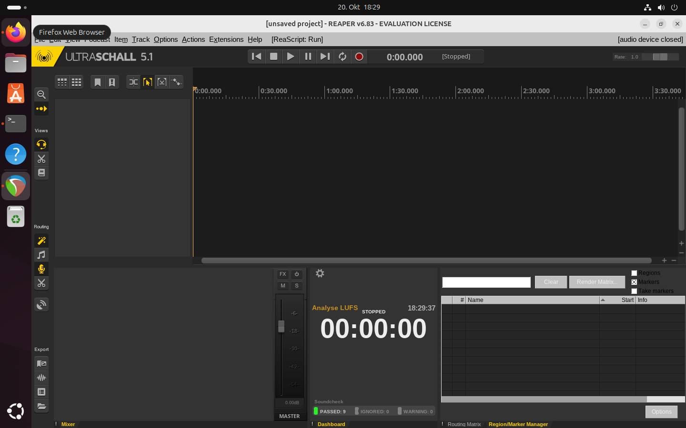

Diese Anleitung zeigt die Installation unter Ubuntu 24.04 LTS, sollte aber für alle gängigen Distributionen funktionieren (Fedora Linux wurde auch getestet).

Um dieser Anleitung zu folgen, gehe ich davon aus, dass man zumindest ein grobes Verständnis für das Terminal mitbringt. Alle Befehle, die man ins Terminal eingeben muss, fangen mit `$` an und sind in Festschrift. Das Dollar-Zeichen soll man nicht miteingeben. Es zeigt nur, dass es ein Terminal-Befehl ist.

Diese Anleitung umfasst folgende Schritte:

1. Reaper installieren
2. Ultraschall installieren

### 1) Reaper installieren

Unter http://reaper.fm/download-old.php?ver=6x kann man das Standard-Linux-Paket runterladen. Bei mir ist es `reaper683_linux_x86_64.tar.xz`. d.h. die Version 6.83.

Wir wechseln zum Ordner, in dem sich das Paket befindet und entpacken es:

```
$ cd ~/Downloads
$ tar xvf reaper683_linux_x86_64.tar.xz
```

das entpackt in diesem Ordner den Ordner `reaper_linux_x86_64` , wir wechseln also in diesen Ordner:

```
$ cd reaper_linux_x86_64/
```

Wir geben ein:

```
$ ./install-reaper.sh
```

Und sehen dann:

```
$ ./install-reaper.sh
REAPER installation script
-------------------------------------------------------------------------------
Available commands:
  [V]iew readme-linux.txt and REAPER license agreement

  [R]un REAPER from /home/user/Downloads/reaper_linux_x86_64/REAPER/reaper

     You can run REAPER without installing it.

  [I]nstall REAPER (you will be prompted for various options)

     This install script can put the REAPER program into /opt
     or ~/opt, or a path of your choice, and optionally set
     up desktop integration (menu items, file associations).

  [A]dd desktop integration for /home/user/Downloads/reaper_linux_x86_64/REAPER/reaper

     If you've extracted REAPER into the path you would like
     it to live in (/home/user/Downloads/reaper_linux_x86_64/REAPER), you can set
     up desktop integration (menu items, file associations,
     etc) via this action.

Command [V,R,I,A]: I
```

Wir geben als "I" ein und drücken Enter, wir sehen dann:

```
Install REAPER
  [1] Install to /opt (in /opt/REAPER) [will require sudo password entry]
  [2] Install to /home/user/opt (in ~/opt/REAPER)

  Or, enter a path starting with / or ~/ to install to that path
  (e.g. /foo to install into /foo/REAPER, or ~/foo to install into ~/foo/REAPER)

Path to install [1,2, or /whatever]: 2
```

Hier wählen wir Option "2". Wir sehen dann:

```
Would you like to add desktop integration for this install [Y/N]?: Y
```

Hier wählen wir "Y". Dann:

```
Confirm:
  Copy files to: /home/user/opt/REAPER
  + Perform desktop integration for /home/user/opt/REAPER/reaper

Proceed with installation [Y/N]?: Y
```

Hier wieder "Y" und sehen dann ganz am Ende `*** Installation complete`.

Damit ist Reaper erstmal installiert. Wir starten Reaper zum ersten Mal mit:

```
$ ~/opt/REAPER/reaper
```

Es ist auch möglich, Reaper via Maus zu starten wie jedes andere Programm auch, da ein Desktop-Eintrag erstellt wurde.

Hier können wir nun den Lizenz-Schlüssel eingeben oder aber erstmal Reaper evaluieren.

Wenn wir hier ein Fenster sehen mit dem Fehler "Error opening devices" können wir das erstmal ignorieren und "Close" klicken. Damit sollte Reaper erstmal laufen. Wir **müssen nun Reaper schliessen** und kommen zu Schritt 2.

### 2) Ultraschall installieren

Wir holen uns jetzt das aktuelle Release 5.1 für Linux unter: https://github.com/Ultraschall/ultraschall-installer/releases/tag/V5.1_6_202410180942

Zum jetzigen Zeitpunkt ist das "V5.1", dazu bei "Assets" das Paket ` Ultraschall-5.1.tar.gz` herunterladen.

Wir gehen wieder zum Ordner und entpacken das Ultraschall-Paket:

```
$ cd ~/Downloads
$ tar xvf Ultraschall-5.1.tar.gz
```

das entpackt Ultraschall in den Ordner "Ultraschall-5.1". Wir wechseln in den Ordner und installieren Ultraschall:

```
$ cd Ultraschall-5.1/
$ ./install.sh
```

Wir sehen dann:

```
Your current REAPER configuration has been saved to /home/user/.config/ultraschall/backups/20220127T202141.
Installing the Ultraschall REAPER Theme...
Done.
Installing the Ultraschall REAPER Plug-ins...
Done.
Installing the Ultraschall StudioLink plugin...
Done.
Installing the Ultraschall StudioLink OnAir plugin...
Done.
Installing the Ultraschall Soundboard plugin...
Done.
Installing the Ultraschall REAPER Scripts...
Done.
```

Wir starten dann wieder Reaper (oder via UI):

```
$ ~/opt/REAPER/reaper
```

Wenn alles geklappt hat, sehen wir das Ultraschall-Fenster mit dem Titel. Somit haben wir die Installation an und für sich erstmal abgeschlossen und man kann loslegen!



Wie man am besten die Audio-Einstellung tätigt, beschreibt die Anleitung [Audio einrichten unter Linux mit Reaper/Ultraschall (Pulseaudio und Pipewire)](https://sendegate.de/t/anleitung-audio-einrichten-unter-linux-mit-reaper-ultraschall-pulseaudio-und-pipewire/15052)
