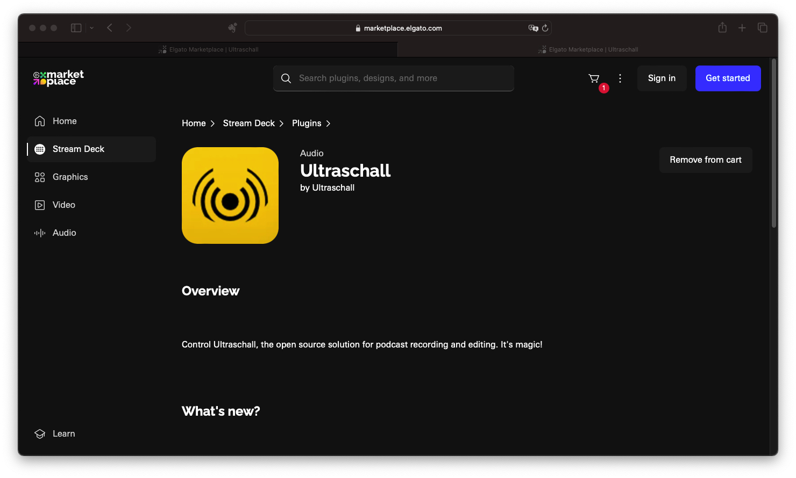
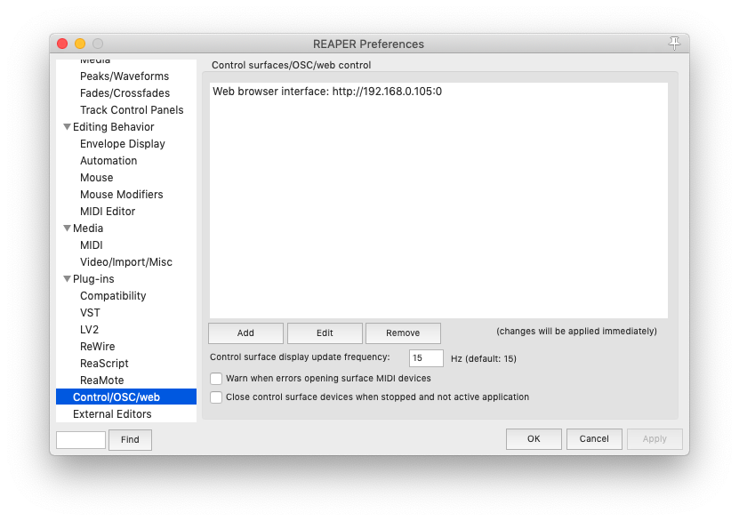
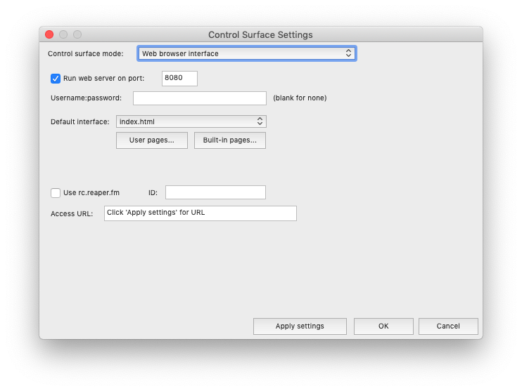
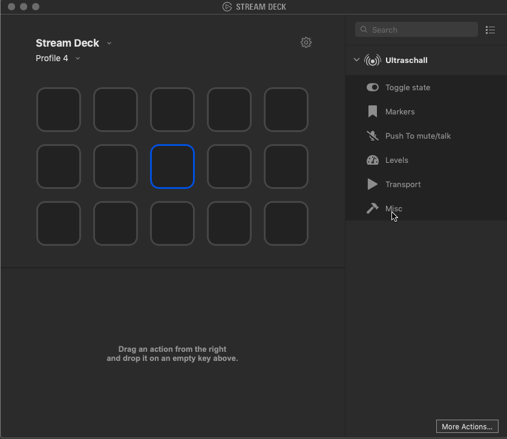

Dieses Tutorial beschreibt kurz wie man das Streamdeck Plugin für Ultraschall einrichtet. Wir nehmen dabei an, dass Ultraschall bereits installiert ist.

## 1. Plugin installieren

Das Streamdeck-Plugin lässt sich über den [Elgato Market Place](https://marketplace.elgato.com) herunterladen. Einfach in der Suchleiste nach `Plugin Ultraschall` suchen und das Ultraschall-Plugin auswählen.

**Ultraschall Plugin**: _So sieht die Auswahl für das Plugin aus._

:::info Info
Es gibt im Market Place bereits zwei Plugins es ist außerdem im neuen Market Place notwendig einen Account anzulegen.
:::

## 2. Konfiguration von Ultraschall:

Es ist notwendig, eine Verbindung von Ultraschall mit dem Streamdeck herzustellen, damit Ultraschall (Reaper) das Drücken der Tatsten verarbeiten kann. Dazu musst du die Einstellungen von Reaper öffnen.

1. Einstellungen öffnen (Mac `CMD+,`, Windows: `CTRL+P`)
2. In der linken Spalte ganz nach unten scrollen und `Control/OSC/web` anklicken.

**Ultraschall Einstellungen**: _Control OSC auswählen._

3. Im rechten Bereich nun `Web browser interface…` anklicken und editieren
4. Das Häckchen vor `Run web server on port: `setzen und ggf. die Portnummer ändern.

 
**Ultraschall Präferenzen**: _Control Surface Settings._

5. Mit `OK` bestätigen. Falls es eine Fehlermeldung bzgl. des Ports gibt einen anderen ausprobieren z.B. `8081`.

## 2. Konfiguration der Stream Deck Plugins:
1.  Eine Action aus dem Ultraschallbereich auf eine Taste ziehen.
2.  Taste anlicken und im unteren Teil den Button `Global Settings` drücken.
3.  Bei „Ultraschall Web Browser Interface IP-Adress“ 127.0.0.1 und den Port aus der Reaper Konfiguration eintragen.
4.  `save` drücken und das Fenster schließen.

**Konfiguration Stream Deck Plugin**: _So wird das Plugin konfiguriert._

Jetzt nach Belieben Actions auf Stream Deck Buttons ziehen und einstellen.
Mehr zu den verschiedenen Funktionen erfahrt ihr in diesem Video:

## Video

  <iframe src="https://ultraschall.github.io/ultraschall-manual/youtube/?url=LeDNF-GWdxI" title="YouTube video player" allowFullScreen="allowfullscreen" class="video">
  </iframe>

Vielen Dank nochmal an Udo! 

