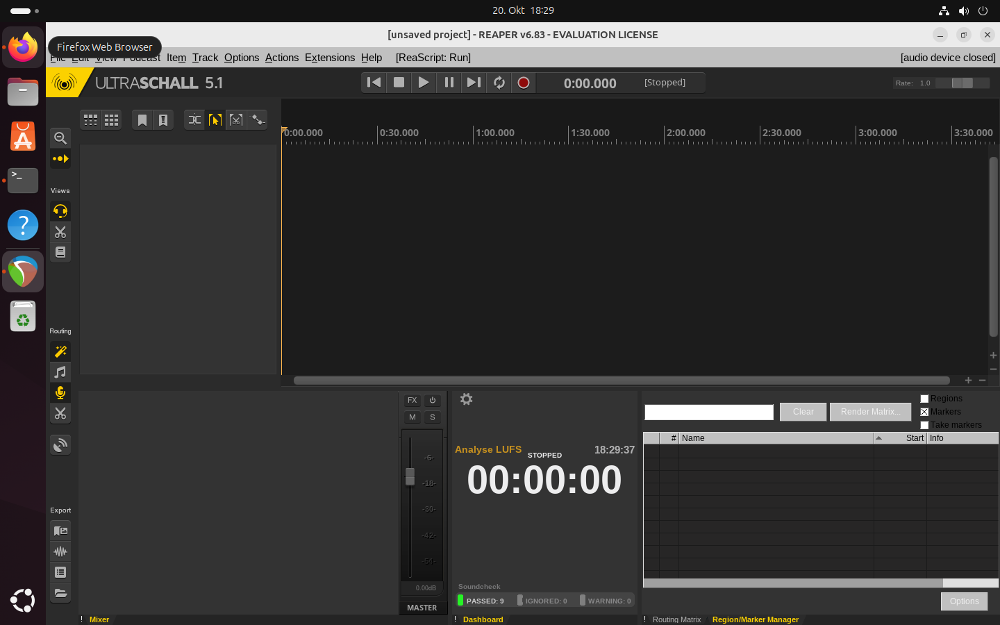

本指南示範在 Ubuntu 24.04 LTS 上進行安裝，但應適用於所有常見的發行版（也測試過 Fedora Linux）。

要遵循本指南，我們假設您至少對終端機有基本的瞭解。您需要輸入到終端機的所有指令都以 `$` 開頭，並使用單行字。請勿包含美元符號。它只是表示這是一個終端命令。

本指南涵蓋下列步驟：


1. 安裝 Reaper
2. 安裝超音波

### 1) 安裝 Reaper

您可以從 http://reaper.fm/download-old.php?ver=6x 下載標準的 Linux 套件。在我的例子中，它是「reaper683_linux_x86_64.tar.xz」，版本為 6.83。


我們導航到套件所在的資料夾，並將其解壓縮：


```
$ cd ~/Downloads
$ tar xvf reaper683_linux_x86_64.tar.xz
```

這會解壓縮此目錄中的 `reaper_linux_x86_64` 資料夾，因此我們變更到該資料夾：


```
$ cd reaper_linux_x86_64/
```

然後我們就跑


```
$ ./install-reaper.sh
```

你應該看看

```
$ ./install-reaper.sh
REAPER installation script
-------------------------------------------------------------------------------
Available commands:
  [V]iew readme-linux.txt and REAPER license agreement

  [R]un REAPER from /home/user/Downloads/reaper_linux_x86_64/REAPER/reaper

     You can run REAPER without installing it.

  [I]nstall REAPER (you will be prompted for various options)

     This install script can put the REAPER program into /opt
     or ~/opt, or a path of your choice, and optionally set
     up desktop integration (menu items, file associations).

  [A]dd desktop integration for /home/user/Downloads/reaper_linux_x86_64/REAPER/reaper

     If you've extracted REAPER into the path you would like
     it to live in (/home/user/Downloads/reaper_linux_x86_64/REAPER), you can set
     up desktop integration (menu items, file associations,
     etc) via this action.

Command [V,R,I,A]: I
```

我們輸入「I」，然後按 Enter，您就會看到：

```
Install REAPER
  [1] Install to /opt (in /opt/REAPER) [will require sudo password entry]
  [2] Install to /home/user/opt (in ~/opt/REAPER)

  Or, enter a path starting with / or ~/ to install to that path
  (e.g. /foo to install into /foo/REAPER, or ~/foo to install into ~/foo/REAPER)

Path to install [1,2, or /whatever]: 2
```

在此，我們選擇選項「2」。然後您會看到

```
Would you like to add desktop integration for this install [Y/N]?: Y
```

我們選擇「Y」。接下來，您會看到


```
Confirm:
  Copy files to: /home/user/opt/REAPER
  + Perform desktop integration for /home/user/opt/REAPER/reaper

Proceed with installation [Y/N]?: Y
```

我們以 「Y 「確認，最後，它應該會說 」*** 安裝完成」。

Reaper 現在已經安裝完成。要首次啟動 Reaper，請執行：

```
$ ~/opt/REAPER/reaper
```

也可以像其他程式一樣透過滑鼠啟動 Reaper，因為桌面入口已經建立。

現在您可以先輸入授權金鑰或評估 Reaper。

如果您看到 「Error opening devices「（打開設備出錯）錯誤視窗，您可以暫時忽略它，然後點擊 」Close」（關閉）。Reaper 現在應該會執行。**我們現在必須關閉 Reaper**，並進行步驟 2。


### 2) 安裝 Ultraschall

:::info
Reaper must be closed for the following installation.
:::

現在，我們從 https://github.com/Ultraschall/ultraschall-installer/releases/latest 下載最新的 Linux 版本 5.1。

在撰寫本文時，這是版本 「V5.1」。在 「Assets 」下，下載套件`Ultraschall-5.1.tar.gz`。

我們回到資料夾，解壓縮 Ultraschall 套件：

```
$ cd ~/Downloads
$ tar xvf Ultraschall-5.1.tar.gz
```

這將 Ultraschall 解壓縮到 「Ultraschall-5.1 」資料夾。我們切換到該資料夾，安裝 Ultraschall：

```
$ cd Ultraschall-5.1/
$ ./install.sh
```

您將會看到

```
Your current REAPER configuration has been saved to /home/user/.config/ultraschall/backups/20220127T202141.
Installing the Ultraschall REAPER Theme...
Done.
Installing the Ultraschall REAPER Plug-ins...
Done.
Installing the Ultraschall StudioLink plugin...
Done.
Installing the Ultraschall StudioLink OnAir plugin...
Done.
Installing the Ultraschall Soundboard plugin...
Done.
Installing the Ultraschall REAPER Scripts...
Done.
```

然後重新啟動 Reaper (或透過使用者介面)：

```
$ ~/opt/REAPER/reaper
```

如果一切正常，您會看到標題為 Ultraschall 的視窗。現在安裝已經完成，您可以開始使用了！



Ubuntu 24.04 LTS 和許多其他發行版現在使用 Pipewire（推薦解決方案）。如何以最佳方式設定音訊設定，請參閱指南 [Setting up audio on Linux with Reaper/Ultraschall (Pulseaudio and Pipewire)](https://sendegate.de/t/anleitung-audio-einrichten-unter-linux-mit-reaper-ultraschall-pulseaudio-und-pipewire/15052)。
